# OS boot

- [OS boot](#os-boot)
  - [LogIn without password](#login-without-password)
    - [init](#init)
    - [rd.break](#rdbreak)
    - [rw init sysroot](#rw-init-sysroot)
  - [Rename root VG](#rename-root-vg)
    - [Run via script](#run-via-script)
  - [Custom initrd module](#custom-initrd-module)

## LogIn without password

First open VirtualBox.
Then run vagrant VM
```shell
vagrant up
```
and stop boot brocess on grub boot menu.

### init

1. Select grub menu item by arrows up/down and press `e` to edit it.
2. Add `init=/bin/sh` at end of line started with `linux16`
   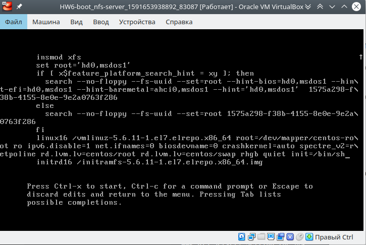
3. Press `ctrl+x` to boot with updated menu item... And we're in!
   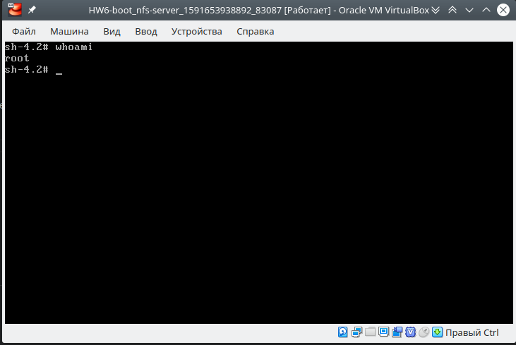
4. Remount rootfs with write access
   ```shell
   mount -o remount,rw /
   ```
5. Profit!

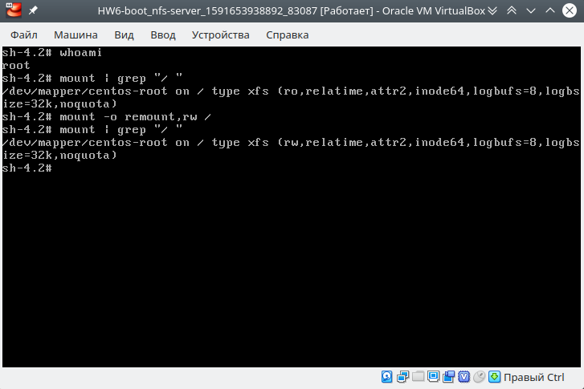

> Here we run `/bin/sh` instead of default init process.
> So result of command `echo $$` is `1` - it's a PID of `/bin/sh` process.
> 
> 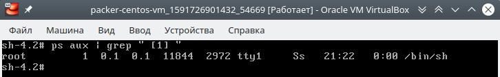
> 
> It's a bit tricky method.s
> 
> The main difference with `rd.break` mothod: we're getting access into a root FS right away.

### rd.break

1. Select grub menu item by arrows up/down and press `e` to edit it.
2. Add `rd.break` at end of line started with `linux16`
   
3. Press `ctrl+x` to boot with updated menu item... And we're in!
   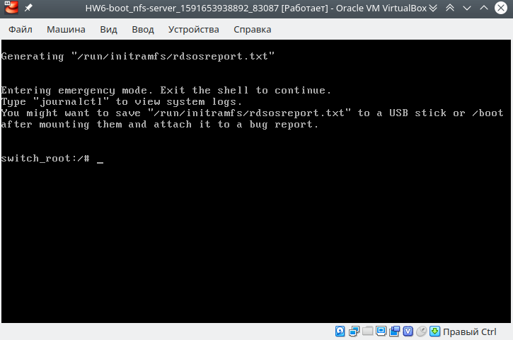
4. Now root filesystem is available at `/sysroot`. Remount it readwrite
   ```shell
   mount -o remount,rw /sysroot
   ```
5. Chroot to `/sysroot` and change `root` password
   ```shell
   chroot /sysroot
   passwd root
   touch /.autorelabel
   ```
   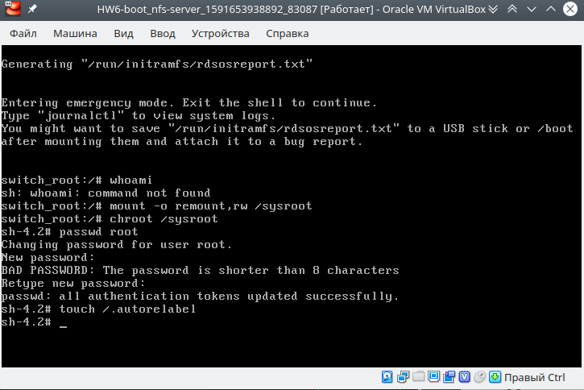
6. Then exit chroot, reboot and try to login as root with new password
   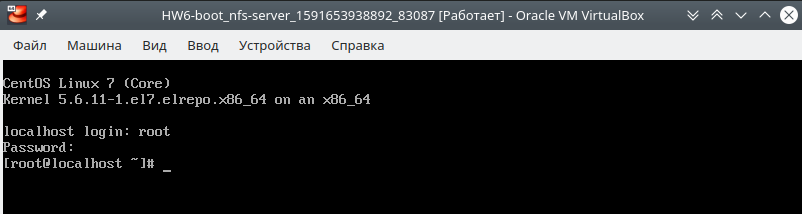

> This method is described in official [documentation](https://access.redhat.com/documentation/en-us/red_hat_enterprise_linux/7/html/system_administrators_guide/sec-Terminal_Menu_Editing_During_Boot#proc-Resetting_the_Root_Password_Using_rd.break) as recommended to reset a root password without the Installation Disk.
> It just drops us to a shell at the end of initrd execution and before to take a control to the linux kernel. See [dracut cmdline documentation](https://man7.org/linux/man-pages/man7/dracut.cmdline.7.html) for details.
> 
> The main difference with `init=/bin/sh` method: we're getting in to a initrd environment and root FS is mounted at `/sysroot` directory.

### rw init sysroot

1. Select grub menu item by arrows up/down and press `e` to edit it.
2. Replace `ro` to `rw` and append `init=/sysroot/bin/sh` at end of line started with `linux16`
   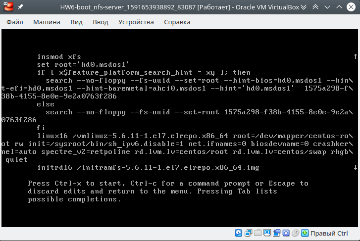
3. Press `ctrl+x` to boot with updated menu item... And we're in!
   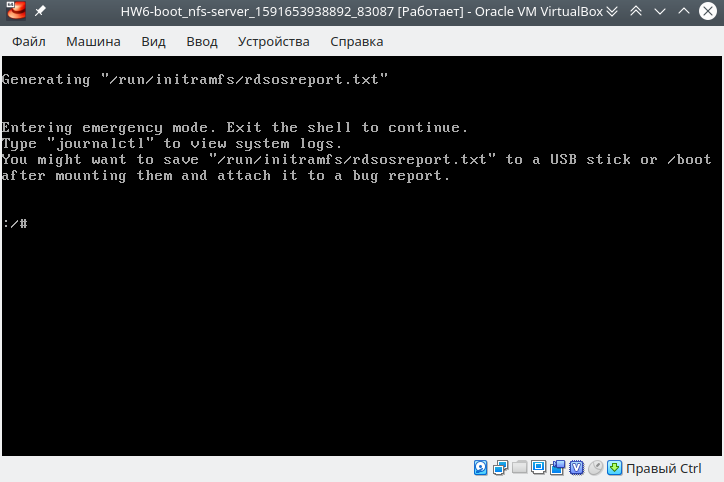
4. And we already have write access to sysroot
   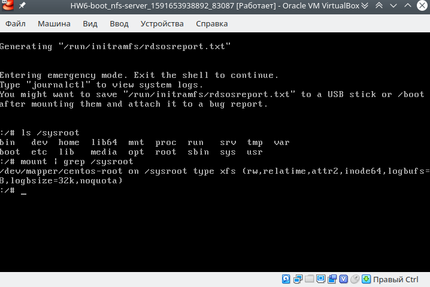


## Rename root VG

First, recreate VM (VM was renamed to `hw6`)
```shell
vagrant destroy
vagrant up
vagrant ssh
```

Check current config
```shell
sudo vgs
```
```log
  VG     #PV #LV #SN Attr   VSize  VFree
  centos   1   2   0 wz--n- <9,00g    0
```
The name of VG is `centos`.

Let's rename it to `OtusRoot`
```shell
sudo vgrename centos OtusRoot
```
```log
  Volume group "centos" successfully renamed to "OtusRoot"
```

Fix `/etc/fstab`
```shell
sudo sed -i.old 's#^/dev/mapper/centos-#/dev/mapper/OtusRoot-#g' /etc/fstab
cat /etc/fstab
```
```fstab
...
/dev/mapper/OtusRoot-root /                       xfs     defaults        0 0
UUID=1575a298-f38b-4155-8e0e-9e2a0763f286 /boot                   xfs     defaults        0 0
/dev/mapper/OtusRoot-swap swap                    swap    defaults        0 0
```

Fix `/etc/default/grub`
```shell
sudo sed -i.old 's#lvm.lv=centos/#lvm.lv=OtusRoot/#g' /etc/default/grub
cat /etc/default/grub
```
```shell
GRUB_TIMEOUT=5
GRUB_DISTRIBUTOR="$(sed 's, release .*$,,g' /etc/system-release)"
GRUB_DEFAULT=saved
GRUB_DISABLE_SUBMENU=true
GRUB_TERMINAL_OUTPUT="console"
GRUB_CMDLINE_LINUX="ipv6.disable=1 net.ifnames=0 biosdevname=0 crashkernel=auto spectre_v2=retpoline rd.lvm.lv=OtusRoot/root rd.lvm.lv=OtusRoot/swap rhgb quiet"
GRUB_DISABLE_RECOVERY="true"
```

Fix `/boot/grub2/grub.cfg`
```shell
sudo sed -i.old1 's#/dev/mapper/centos-#/dev/mapper/OtusRoot-#g' /boot/grub2/grub.cfg
sudo sed -i.old2 's#lvm.lv=centos/#lvm.lv=OtusRoot/#g' /boot/grub2/grub.cfg
sudo cat /boot/grub2/grub.cfg
```
[output](./assets/vg-renamed-grub.cfg)

Regenerate `initrd` with new VG name
```shell
sudo mkinitrd -f -v /boot/initramfs-$(uname -r).img $(uname -r)
```
[output](./assets/mkinitrd.log)

And finally reboot
```shell
sudo reboot
```

Check result
```shell
sudo vgs
```
```log
  VG       #PV #LV #SN Attr   VSize  VFree
  OtusRoot   1   2   0 wz--n- <9,00g    0
```

### Run via script

Script [rename-vg.sh](./scripts/rename-vg.sh) must be applied to newly created VM.

Run on host
```shell
vagrant ssh < scripts/rename-vg.sh 2>&1 | tee ./assets/rename-vg.log
vagrant reload
```
[output](./assets/rename-vg.log)

Ensure VG was renamed (run on host)
```shell
vagrant ssh -c "sudo vgs"
```
```log
  VG       #PV #LV #SN Attr   VSize  VFree
  OtusRoot   1   2   0 wz--n- <9,00g    0 
Connection to 127.0.0.1 closed.
```

Done!

> Note: VM hangs after `reboot` or `shutdown -r now` at end of script. It's solved by run `vagrant reload` after script completed to work.


## Custom initrd module

First recreate VM

Do on host
```shell
vagrant destroy
vagrant up
```

Module's scripts must be stored at `/usr/lib/dracut/modules.d/`. So let's place our script there.

Create directory `01test` and download `module-setup.sh`
```shell
sudo mkdir -p /usr/lib/dracut/modules.d/01test
curl --silent https://gist.githubusercontent.com/lalbrekht/e51b2580b47bb5a150bd1a002f16ae85/raw/80060b7b300e193c187bbcda4d8fdf0e1c066af9/gistfile1.txt | sudo tee /usr/lib/dracut/modules.d/01test/module-setup.sh
sudo chmod +x /usr/lib/dracut/modules.d/01test/module-setup.sh
```
<details><summary>output</summary>
<p>

```shell
#!/bin/bash

check() {
    return 0
}

depends() {
    return 0
}

install() {
    inst_hook cleanup 00 "${moddir}/test.sh"
}
```
</p>
</details>


Download module script `test.sh`
```shell
curl --silent https://gist.githubusercontent.com/lalbrekht/ac45d7a6c6856baea348e64fac43faf0/raw/69598efd5c603df310097b52019dc979e2cb342d/gistfile1.txt | sudo tee /usr/lib/dracut/modules.d/01test/module-setup.sh
sudo chmod +x /usr/lib/dracut/modules.d/01test/module-setup.sh
```
<details><summary>output</summary>
<p>

```shell
#!/bin/bash

exec 0<>/dev/console 1<>/dev/console 2<>/dev/console
cat <<'msgend'

Hello! You are in dracut module!

 ___________________
< I'm dracut module >
 -------------------
   \
    \
        .--.
       |o_o |
       |:_/ |
      //   \ \
     (|     | )
    /'\_   _/`\
    \___)=(___/
msgend
sleep 10
echo " continuing...."
```
</p>
</details>

Regenerate `initrd`
```shell
# sudo mkinitrd -f -v /boot/initramfs-$(uname -r).img $(uname -r)
# or
sudo dracut -f -v
```
```log
Executing: /sbin/dracut -f -v
```

Ensure module is installed
```shell
sudo lsinitrd -m /boot/initramfs-$(uname -r).img | grep test
```
```log
test
```

Remove grub boot options `rghb` and `quiet` from kernel cmdline
```shell
sudo sed -i.old 's/ rhgb quiet//g' /etc/default/grub
sudo grub2-mkconfig -o /boot/grub2/grub.cfg
```
<details><summary>output</summary>
<p>

```log
Generating grub configuration file ...
Found linux image: /boot/vmlinuz-5.6.11-1.el7.elrepo.x86_64
Found initrd image: /boot/initramfs-5.6.11-1.el7.elrepo.x86_64.img
Found linux image: /boot/vmlinuz-3.10.0-1127.el7.x86_64
Found initrd image: /boot/initramfs-3.10.0-1127.el7.x86_64.img
Found linux image: /boot/vmlinuz-0-rescue-db529269582b41d89d3f9aed34b3ff97
Found initrd image: /boot/initramfs-0-rescue-db529269582b41d89d3f9aed34b3ff97.img
done
```
</p>
</details>

Reboot and see:
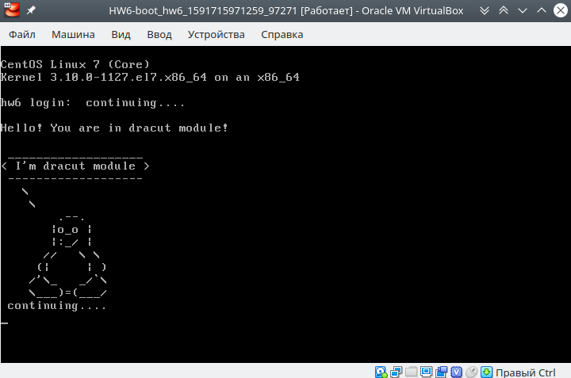
